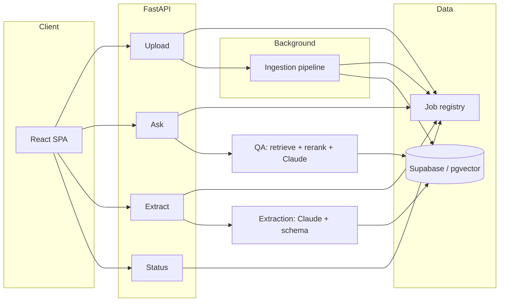
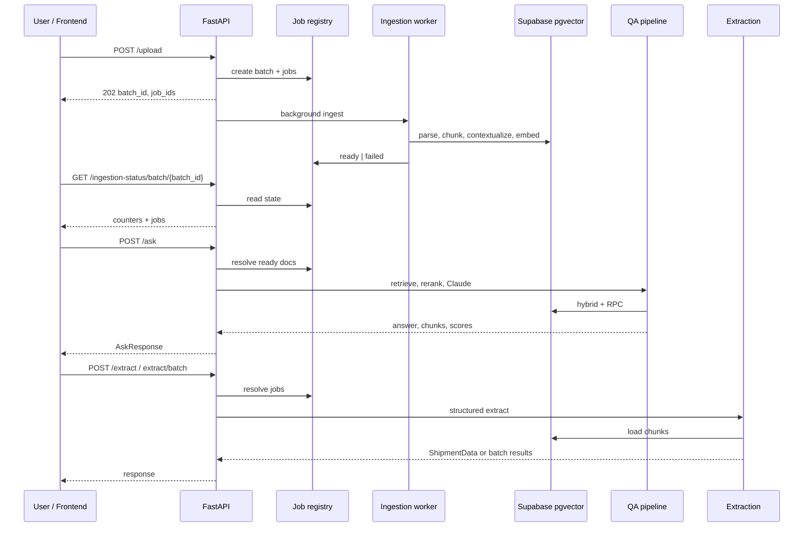

# Ultra Doc-Intelligence Architecture

## Objective

Ultra Doc-Intelligence is an agentic document intelligence stack for logistics operations. It ingests carrier and customer shipping documents (PDF, DOCX, TXT), builds searchable vectorized knowledge, answers natural-language questions with grounded context, and extracts structured shipment JSON.

The product emphasizes asynchronous multi-file ingestion, hybrid retrieval, guardrails and confidence scoring, and both single-document and cross-document (batch) workflows.

---

## Product scope

### Core capabilities

- Batch upload and async ingestion (`POST /upload` + background workers)
- Pollable ingestion status (`GET /ingestion-status/{job_id}`, `GET /ingestion-status/batch/{batch_id}`)
- Grounded Q&A (`POST /ask`) over one ready job or a whole ready batch
- Structured extraction (`POST /extract`, `POST /extract/batch`)
- Health (`GET /health`, `GET /`)

### Frontend (high level)

The UI under `frontend/` is a React + TypeScript + Vite single-page app. It drives the full demo flow: multi-file upload with live ingestion status, batch or single-job **Ask** (markdown answers, metrics, guardrail badge, optional chunk disclosure), and **Extract** (JSON including `shipment_data`). It calls the FastAPI backend via a small typed client; styling is plain CSS (dark theme). It is intentionally thinner than the backend: no duplicate business logic—only orchestration, forms, and presentation.

---

## How to run

**Backend** (from `ultra-doc-intelligence/backend`, with `.env` configured):

```bash
cd backend
pip install -r requirements.txt
uvicorn main:app --reload --host 127.0.0.1 --port 8000
```

**Frontend** (from `ultra-doc-intelligence/frontend`):

```bash
cd frontend
npm install
npm run dev
```

Open the app in the browser at:

**[http://localhost:5173](http://localhost:5173)**

(API docs: **[http://127.0.0.1:8000/docs](http://127.0.0.1:8000/docs)**)

On Windows PowerShell, use the same commands after `cd` to the respective folders.

---

## High-level architecture




---

## Detailed technical components (pipeline order)

1. **Configuration** (`config.py`) — Pydantic Settings: Anthropic/OpenAI keys, exact model IDs, embedding dimensions, retrieval k-values, guardrail thresholds, upload limits, CORS.
2. **Document parsing** (`services/parser.py`) — Docling conversion to markdown/text; load-id / document-type heuristics for metadata.
3. **Chunking** (`services/chunker.py`) — Primary: Docling **HybridChunker**. Fallback: **LangChain** `RecursiveCharacterTextSplitter` when the primary path is unavailable; preserves headings, order, and page hints where present.
4. **Contextualization** (`services/contextualizer.py`, `prompts/contextual_retrieval_prompt.py`) — Per-chunk context prefixes via Anthropic. The prompt marks the **full-document block with Anthropic prompt cache** (`cache_control: ephemeral`) so repeated chunk calls reuse cached prefix tokens; usage metrics log cache read vs fresh input.
5. **Embeddings** (`services/embedder.py`) — **OpenAI** embeddings via LangChain `OpenAIEmbeddings(model=settings.embedding_model_name)`. Default model: `text-embedding-3-small` with `embedding_dimensions=1536`.
6. **Cross-encoder reranking** (`services/embedder.py`) — HuggingFace cross-encoder via LangChain community `HuggingFaceCrossEncoder(model_name=settings.reranker_model_name)`. Default reranker model: `BAAI/bge-reranker-base`.
7. **Vector storage & dedup** (`db/vector_store.py`, `db/client.py`) — Supabase tables for documents, chunks, embeddings; **SHA-256 file hash** lookup skips re-ingestion for identical content.
8. **Hybrid retrieval** (`services/retriever.py`) — Per-document **pgvector** cosine match + **pg_trgm** keyword RPCs; **Reciprocal Rank Fusion (RRF)** merges lists; cross-encoder **rerank** produces final ordering.
9. **Batch QA** (`agents/qa_agent.py`) — Parallel retrieve per document, **merge + global cross-encoder rerank** so scores are comparable across files; answers via **Anthropic Messages API** (`model=settings.anthropic_model`, default `claude-sonnet-4-20250514`) with `prompts/qa_system_prompt.py`. **Refusal detection** aligns `guardrail_triggered`, empty `chunks_used`, and `source_documents: null` with “not in document” outcomes.
10. **Pydantic AI agents & tools** (`agents/ingestion_agent.py`, `agents/qa_agent.py`, `tools/*.py`) — **Pydantic AI** `Agent` wiring with Anthropic models; tools such as `retrieve_chunks` / `rerank_chunks` (LangChain tool adapters) support tool-calling style orchestration alongside the main direct-call QA path.
11. **Guardrails & confidence scoring** (`services/guardrails.py`) — Similarity gate on top retrieved chunk; **LLM-as-judge** (Claude Sonnet via `settings.anthropic_model`) for faithfulness and claim coverage; query-aware composite score; `is_refusal()` for API alignment.
12. **Structured extraction** (`agents/extraction_agent.py`, `schemas/shipment_schema.py`, `prompts/extraction_system_prompt.py`) — Full-chunk context from DB; Claude output validated as **ShipmentData**.
13. **Job registry** (`services/ingestion_jobs.py`) — In-memory batches and jobs (volatile across restarts).

---

## Runtime model stack and scoring defaults

- **Primary LLM (QA + extraction + contextualizer + judge):** `settings.anthropic_model` (default `claude-sonnet-4-20250514`)
- **Claude max tokens (QA/extract):** `anthropic_max_tokens=1024`
- **Contextualizer max tokens:** `contextualizer_max_tokens=200`
- **Embedding model:** `settings.embedding_model_name` (default `text-embedding-3-small`)
- **Embedding dimension:** `embedding_dimensions=1536`
- **Cross-encoder reranker:** `settings.reranker_model_name` (default `BAAI/bge-reranker-base`)

All values are configurable via environment variables (`.env`) through `config.py`.

---

## RAGAS-style confidence implementation (actual code path)

Confidence is computed in `services/guardrails.py::evaluate_answer()` using three signals:

1. **Faithfulness** (`_compute_faithfulness`)
  - LLM-judge output: `total_claims`, `supported_claims`
  - Formula: `supported_claims / total_claims` (**RAGAS faithfulness-style formula**)
2. **Answer relevancy** (`_compute_claim_coverage`)
  - Binary checks for `responsive` and `concrete`
  - Score: mean of those two binaries
3. **Context relevancy**
  - Single-doc: `sigmoid(rerank_score)` from cross-encoder  
  - Cross-doc: source coverage across expected documents

Composite weighting:

- **Single-doc:** `0.55 * faithfulness + 0.25 * answer_relevancy + 0.20 * context_relevancy`
- **Cross-doc:** `0.60 * faithfulness + 0.20 * answer_relevancy + 0.20 * context_relevancy`

Thresholds:

- **Similarity gate:** `guardrail_similarity_threshold=0.25`
- **Low confidence warning:** `guardrail_low_confidence_threshold=0.20`

---

## End-to-end workflow

### 1) Upload and ingestion

1. `POST /upload` with multipart `files`.
2. Validate extension, size, and batch count; compute SHA-256; write temp files.
3. Create `batch_id` and per-file `job_id`; return **202** immediately.
4. Background pipeline (bounded concurrency): parse → chunk → contextualize → embed → store; hash hit short-circuits to existing document.
5. Status: `pending → processing → ready | failed`.

### 2) Ask

1. `POST /ask` with `question`, `top_k`, and exactly one of `job_id` or `batch_id`.
2. Hybrid retrieve → RRF → cross-encoder rerank (global rerank for batch).
3. Claude generates answer from context only.
4. Guardrails and scoring; refusals set `guardrail_triggered: true`, `chunks_used: []`, `source_documents: null`.

### 3) Extraction

1. `POST /extract` with `job_id`, or `POST /extract/batch?batch_id=...`.
2. Resolve ready jobs; fetch chunk text; LLM → `ShipmentData` (or per-file batch rows with `success | failed | skipped`).

### 4) Status

- `GET /ingestion-status/{job_id}` — one job.
- `GET /ingestion-status/batch/{batch_id}` — aggregate counters and job list.

---

## API contracts (operational)


| Method | Path                                 | Notes                                                   |
| ------ | ------------------------------------ | ------------------------------------------------------- |
| POST   | `/upload`                            | Multipart `files`; **202** + `batch_id`, `jobs[]`       |
| GET    | `/ingestion-status/{job_id}`         | Job state, `document_id` when ready                     |
| GET    | `/ingestion-status/batch/{batch_id}` | Aggregate + `jobs[]`                                    |
| POST   | `/ask`                               | JSON: `question`, `top_k`, and `job_id` *or* `batch_id` |
| POST   | `/extract`                           | JSON: `job_id` → `ShipmentData`                         |
| POST   | `/extract/batch?batch_id=`           | Batch extraction summary + `results[]`                  |


OpenAPI entries for `/upload`, `/ask`, and `/extract` intentionally use minimal response documentation (success + **400** + **404** model hooks); the service may still return other HTTP codes (e.g. 422) for validation or readiness.

---

## Response shape notes you should rely on

### `/ask` response fields (`AskResponse`)

- `answer`
- `source_documents` (`null` when `guardrail_triggered=true`)
- `confidence_score`
- `faithfulness`
- `answer_relevancy`
- `context_relevancy`
- `guardrail_triggered`
- `chunks_used` (array of `{chunk_id, text, document_name}`)
- `low_confidence_warning`

### `/extract` response fields

`POST /extract` returns full `ShipmentData` (including `document_id` and `extraction_confidence`).

`POST /extract/batch` returns:

- `batch_id`, `total`, `succeeded`, `failed`, `skipped`
- `results[]` with `job_id`, `document_id`, `filename`, `status`, `shipment_data`, `error`

---

## Flowchart (sequence)




---

## Example scenarios (detailed)

### Example A — Batch Q&A: equipment from the rate confirmation only

**Setup:** One batch upload contains `LD53657-Carrier-RC.pdf` and `BOL53657_billoflading.pdf`. Both jobs reach `ready`.

**Request:**

```json
{
  "batch_id": "<your-batch-uuid>",
  "question": "What specific equipment type and size is required for this shipment according to the RC?",
  "top_k": 5
}
```

**Representative response shape:**

```json
{
  "answer": "The rate confirmation requires a 48 ft flatbed. Source: Equipment Requirements, Page 1",
  "source_documents": ["LD53657-Carrier-RC.pdf"],
  "confidence_score": 0.914,
  "faithfulness": 1.0,
  "answer_relevancy": 1.0,
  "context_relevancy": 0.82,
  "guardrail_triggered": false,
  "chunks_used": [
    {
      "chunk_id": "4a7568f2-3fd4-4f11-b6cf-2b1e3f6f8a10",
      "text": "Equipment required: Flatbed 48 ft ...",
      "document_name": "LD53657-Carrier-RC.pdf"
    }
  ],
  "low_confidence_warning": false
}
```

Retrieved context is ranked with a **global cross-encoder** pass so chunks from the BOL are less likely to appear in `chunks_used` when they are weak for this question.

### Example B — Off-topic question: guardrails and empty attribution

**Setup:** Same batch (logistics PDFs ingested and ready).

**Request:**

```json
{
  "batch_id": "<your-batch-uuid>",
  "question": "What is the most spoken language in the world?",
  "top_k": 5
}
```

**Representative response shape:**

```json
{
  "answer": "Not found in document.",
  "source_documents": null,
  "confidence_score": 0.0,
  "faithfulness": 0.0,
  "answer_relevancy": 0.0,
  "context_relevancy": 0.0,
  "guardrail_triggered": true,
  "chunks_used": [],
  "low_confidence_warning": true
}
```

This avoids implying that uploaded files supported an answer about general knowledge.

### Example C — Batch extraction with a not-ready file

**Request:** `POST /extract/batch?batch_id=<batch_uuid>` while one file is still `processing`.

**Expected behavior:** Ready jobs return `status: "success"` with `shipment_data`; not-ready jobs return `status: "skipped"` with an explanatory `error` string. The batch does not fail entirely because one file is still ingesting.

---

## Operational notes

- Job/batch state is **in-memory** and is lost on server restart.
- Upload is asynchronous; clients should poll ingestion status before Ask/Extract.
- Batch Ask/Extract only include **ready** documents; partial batches are supported.
- Concurrency is capped by `ingestion_concurrency` in config.
- Tuning: `config.py` and environment variables (`.env`).

---

